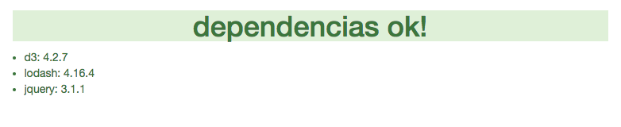

# Taller de d3.js - Codemotion 2016

El 18 de Noviembre, de 11.45 a 14.30 en el Track C voy a impartir un [taller de D3.js](http://2016.codemotion.es/agenda.html#5732408326356992/86464006) en Codemotion

Si tienes pensado asistir, por favor, lee esta introducción, especialmente el apartado de **[Preparación](#preparacion)** más abajo

# ¿Para quien es?

Este taller va dirigido a desarrolladores que tengan soltura con Javascript, que hayan intentado crear alguna visualización de de datos en Web y que se hayan quedado con la sensación de que con d3.js se les escapa algo.

# ¿Por qué este taller?

d3.js es **la** librería para crear visualizaciones de datos complejas. Es sin duda, la librería más potente y más versátil que hay (se puede hacer todo, y controlar la apariencia e interacción hasta el último detalle), pero no siempre es la elección más acertada (siempre empezamos desde cero, tenemos que definir todo, es complicada de utilizar...).

El objetivo del taller es explicar a fondo algunos de los conceptos que hacen de d3.js algo distinto a las demás librerías de visualización.

# ¿Qué vamos a conseguir?

Al final del taller deberías ser capaz de:

* encontrar ejemplos de visualizaciones que se parezcan a lo que quieres hacer y ENTENDER su código
* modificar el ejemplo y/o tus datos para que la visualización use tus datos
* modificar el ejemplo para que la apariencia y la interacción sean exactamente como tu quieres
* integrar la visualización en tu aplicación web o página tanto en maquetación como interacción

# <a name="preparacion"></a>Preparación
La organización de codemotion nos ha pedido que publiquemos instrucciones de qué software debeís llevar instalado en vuestro ordenador para seguir el taller:

Vamos a escribir páginas web con visualizaciones de datos, así que necesitáis:

* cualquier sistema operativo (MacOSX, Linux... incluso Windows!)
* un navegador web
* un editor de código HTML (yo uso Sublime Text 2)


Aunque no sería imprescindible, recomiendo absolutamente:

* tener instalado [node](https://nodejs.org/es/download/package-manager)
* live-server

```
$ npm install -g live-server
```

Preparad una carpeta de trabajo en la que iréis creando los ejemplos y clonad este repo:

```
$ cd directorio_de_trabajo
$ git clone https://github.com/jabadia/d3-workshop
$ cd d3-workshop
```

Instalad las dependencias y probad que todo está bien:

```
$ npm install // o yarn install si sois de los modernos
$ live-server
```

En ese momento se debería abrir vuestro navegador y ver algo así:



Si es así, enhorabuena, vete a la nevera y ábrete una cerveza o una fanta para celebrarlo.

